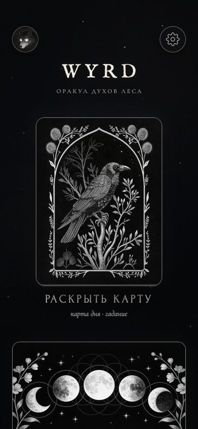
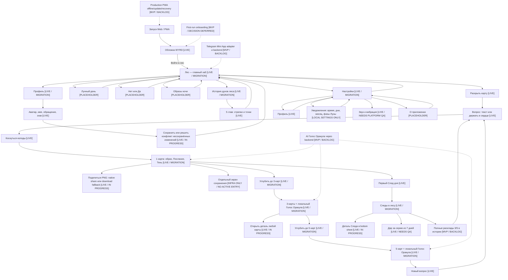

# WYRD — продуктовый и UX-аудит

> [!WARNING]
> Исторический аудит состояния на 2026-07-22. Текущие статусы, маршруты и
> решения находятся в
> [`PRODUCT_SURFACE_MAP.md`](../../../../docs/PRODUCT_SURFACE_MAP.md) и Linear.

**Дата:** 22 июля 2026
**Формат:** отдельный документ для проверки
**Linear:** использован только как источник фактических статусов; задачи и статусы не изменялись
**Версия интерфейса:** текущая рабочая версия проекта на дату аудита; скриншот включает локальные изменения и сам по себе не подтверждает production-deploy

## 1. Короткое заключение

WYRD — атмосферный цифровой оракул духов леса для символической рефлексии. Пользователь задаёт вопрос, получает одну карту-знак и при желании углубляет ответ до расклада из трёх и пяти карт. Продукт не должен обещать неизбежное будущее, принимать решения за пользователя или заменять медицинскую, юридическую и финансовую помощь.

Главная продуктовая идея уже читается ясно: **войти в Лес → задать вопрос → получить знак → углубить чтение → сохранить След → вернуться позже**. Это сильнее всего работает там, где WYRD остаётся одной цельной историей, а не каталогом разрозненных эзотерических инструментов.

Текущая стадия — **функциональная pre-beta вертикаль**, а не готовая Telegram-бета. Основной карточный цикл 1→3→5 существует, но визуальная система ещё мигрирует, три дополнительных пути в Лесу остаются заглушками, полноценный AI-Голос Оракула, Telegram-контур, production PWA/offline, хранение полных раскладов и полная accessibility/platform QA не завершены.

## 2. Что именно проверено

- текущая структура экранов и действий в коде;
- продуктовые документы и runtime-модель состояния;
- текущий главный экран в мобильном viewport `393×852`;
- проект `WYRD — Telegram Beta` и 150 связанных задач в Linear по состоянию на 22 июля 2026;
- официальные продуктовые страницы Labyrinthos, Moonly, Co–Star и Nebula для конкурентного контекста.

Ограничение аудита: визуально зафиксирован главный экран «Лес». Остальные маршруты описаны по текущему интерфейсному коду, проектным документам и Linear, но не являются полным device-by-device usability-тестом. Полное соответствие WCAG, VoiceOver/TalkBack, landscape, Telegram WebView и поведение системных уведомлений этим документом не подтверждаются.

## 3. Текущий главный экран



### Что уже хорошо

- сильный и запоминающийся центр композиции: ворон и действие «Раскрыть карту» сразу объясняют главный вход;
- серебряная графика, чёрный фон и книжная типографика создают собственный мир, а не стандартный мобильный dashboard;
- профиль и настройки доступны с первого экрана и имеют отдельные доступные названия в DOM;
- основное действие значительно заметнее вторичных путей;
- размер интерактивных зон заложен от `44–48 px`, что соответствует выбранному accessibility-baseline.

### Основные риски

- нижняя карточка обрезана границей viewport. Это подсказывает прокрутку, но пользователь ещё не видит, сколько путей находится ниже и чем они отличаются;
- три будущие механики выглядят как полноценные доступные возможности, хотя сейчас открывают заглушки. Это создаёт завышенное ожидание;
- часть тихих подписей и тонких серебряных линий требует фактической проверки контраста на реальных дисплеях, несмотря на приемлемую структуру токенов;
- визуальная система главного экрана уже silver, а несколько внутренних экранов всё ещё принадлежат старому gold-слою. При переходе возникает ощущение другого продукта;
- по одному скриншоту нельзя подтвердить порядок фокуса, видимость focus-ring, управление только клавиатурой и корректность screen reader announcements.

## 4. Главная UX-логика

У WYRD должно быть одно главное обещание и один главный цикл:

> **Пользователь приходит с вопросом, получает не готовое решение, а символический образ, постепенно углубляет его и оставляет След для последующего возвращения.**

Лес выполняет роль хаба, но не должен становиться каталогом одинаково важных функций. В текущем MVP главный путь — карточное чтение 1→3→5. Лунный день, «Нет или Да» и «Образы ночи» пока должны восприниматься как будущие ответвления, а не как равные по зрелости режимы.

## 5. Копируемая схема UX-пути

Легенда:

- `[LIVE]` — уже работает в текущем runtime;
- `[MIGRATION]` — механика работает, но интерфейс или контракт ещё дорабатывается;
- `[PLACEHOLDER]` — вход существует, полноценной механики пока нет;
- `[MVP]` — утверждено для первой беты, но ещё не завершено;
- `[LATER]` — сознательно отложено.



### Текстовая версия схемы

```text
1. Запуск
   1.1 Обложка
   1.2 «Войти в лес»
   1.3 Лес — главный хаб

2. Основной цикл чтения
   2.1 «Раскрыть карту»
   2.2 Ввести вопрос или оставить поле пустым
   2.3 Коснуться колоды
   2.4 Получить 1 карту: образ + Послание + Тень
   2.5 Опционально: поделиться PNG; при отсутствии native share получить download fallback
   2.6 Отдельный экран сохранения подготовлен в коде, но активного пользовательского входа сейчас нет
   2.7 Опционально: углубить до 3 карт
   2.8 Прочитать локальный Голос Оракула
   2.9 Открыть детали отдельных карт
   2.10 Опционально: углубить до 5 карт
   2.11 Новый вопрос или возврат в Лес

3. Память и возвращение
   3.1 Первое чтение дня сохраняется как След
   3.2 «Следы в лесу» показывает историю
   3.3 След открывается в bottom sheet
   3.4 После серии из 7 последовательных дней появляется Дар
   3.5 Полные расклады 3/5 пока не сохраняются в истории

4. Вторичные пути Леса
   4.1 Лунный день — заглушка
   4.2 Нет или Да — заглушка
   4.3 Образы ночи — заглушка
   4.4 История духов леса — 5 иллюстрированных глав

5. Персонализация и настройки
   5.1 Профиль: аватар, имя, обращение, необязательный знак зодиака
   5.2 Защита от потери несохранённых изменений
   5.3 Уведомления: время, дни, первое число, новолуние, полнолуние
   5.4 Звук и вибрация
   5.5 О приложении — техническая заглушка

6. Системные слои MVP
   6.1 First-run onboarding — решение отложено
   6.2 AI Голос Оракула — backend/runtime ещё не подключён
   6.3 Telegram Mini App — adapter, SDK и безопасная сессия ещё не готовы
   6.4 PWA — базовый manifest/cache есть, production offline/update/recovery не приняты
```

## 6. Подробный UX-путь пользователя

### Шаг 1. Вход

Пользователь видит атмосферную обложку и единственное главное действие «Войти в лес». Сейчас обложка показывается при каждой загрузке. Одноразовый first-run onboarding существует в коде как недостижимая поверхность, но его финальный сценарий сознательно отложен до готовности основных механик.

**Состояние:** механика входа работает; first-run не завершён.
**Здоровье:** хорошая простота входа, но нет отдельного объяснения продукта новому пользователю.

### Шаг 2. Лес — главный хаб

Пользователь попадает на главный экран. Сверху доступны Профиль и Настройки. Главный фокус — «Раскрыть карту». Ниже идут Лунный день, «Нет или Да», «Образы ночи», Следы и История духов леса.

**Состояние:** хаб работает и уже переведён в silver-направление.
**Здоровье:** сильный визуальный центр; риск — заглушки выглядят готовыми.

### Шаг 3. Формулировка вопроса

В колоде есть textarea до 280 символов. Пользователь может написать вопрос или оставить его «в сердце». Сырой текст используется для маршрутизации тематики и выбора карт; на результате вопрос отображается пользователю.

**Состояние:** работает локально.
**Здоровье:** низкий порог входа; нужно яснее сообщать, что пустой вопрос допустим и чем отличается от текстового.

### Шаг 4. Одна карта

После касания колоды приложение создаёт чтение, показывает иллюстрацию карты, имя, ключевой образ, Послание и Тень. Первое чтение дня сохраняется как След. Текущий ответ генерируется локальной логикой; production AI-контур ещё не подключён.

**Состояние:** основной runtime работает.
**Здоровье:** сильная завершённая микроистория; визуальная миграция и responsive-проверка результата ещё не закрыты.

### Шаг 5. Sharing и подготовленный экран сохранения

Активная кнопка результата формирует PNG и вызывает системное меню «Поделиться». Если native share недоступен, предусмотрен fallback на загрузку. В коде также подготовлены отдельный save-screen и логика открытия изображения для сохранения в Фото, но в текущей разметке результата нет активной кнопки, которая запускает этот отдельный сценарий. Состояния ожидания и ошибки для sharing присутствуют.

**Состояние:** sharing реализован; отдельный save-flow инфраструктурно подготовлен, но не доступен пользователю; [YUK-54](https://linear.app/yukisakura/issue/YUK-54/adaptirovat-modals-history-sheet-i-saveshare-screen) остаётся `In Progress`.
**Здоровье:** полезный retention/viral-слой; нужен полный platform/landscape/focus/safe-area прогон.

### Шаг 6. Углубление 1→3→5

Из результата одной карты пользователь продолжает к трём картам, получает позиции и локальную связную интерпретацию, может открыть каждую карту в модальном окне, затем углубить чтение до пяти карт. Back возвращает на предыдущий слой ритуала, а «Новый вопрос» очищает текущий ритуал и фокусирует поле вопроса.

**Состояние:** работает локально; AI backend отсутствует.
**Здоровье:** это главное конкурентное отличие WYRD; важно не разрывать его лишними меню, оплатой или несвязанными режимами в первой бете.

### Шаг 7. Следы и Дары

В истории сохраняется первое одиночное чтение каждого дня. Пользователь открывает След в bottom sheet и видит вопрос, карту, Послание и Тень. За семь последовательных дней runtime выдаёт Дар; Дары можно раскрывать на полке.

Полные расклады из трёх и пяти карт пока не сохраняются: это отдельная backlog-задача [YUK-30](https://linear.app/yukisakura/issue/YUK-30/sohranyat-zavershyonnye-rasklady-v-istorii).

**Состояние:** одиночные Следы и код Даров работают; история полных раскладов не готова.
**Здоровье:** хороший повод вернуться без тяжёлой экономики; необходимо объяснить правило «один день — один След» до того, как пользователь потеряет ожидаемое чтение.

### Шаг 8. История духов леса

Пользователь открывает иллюстрированную книгу из пяти глав, листает её стрелками или точками и возвращается в Лес. Это слой мира и эмоциональной привязки, а не техническая справка.

**Состояние:** контент и навигация работают; silver migration не завершена.
**Здоровье:** усиливает уникальный IP, но не должен подменять краткое объяснение того, как пользоваться оракулом.

### Шаг 9. Профиль

Профиль доступен с аватара на главном экране и через Настройки. Пользователь выбирает готовый или собственный аватар, вводит имя, выбирает обращение и при желании знак зодиака. При попытке уйти с изменениями появляется диалог: сохранить, не сохранять или остаться.

**Состояние:** логика работает; интерфейс мигрирует.
**Здоровье:** ясная защита от потери данных; знак зодиака пока почти не участвует в основном ценностном цикле и может восприниматься как обещание несуществующей персонализации.

### Шаг 10. Уведомления, звук и вибрация

Пользователь может настроить время, дни недели, первое число месяца, новолуние и полнолуние, а также звук и вибрацию. Сейчас расписание сохраняется в local state; это ещё не доказанная доставка системных push-уведомлений. Звук и vibration требуют отдельной проверки Web/PWA/Telegram lifecycle.

**Состояние:** UI и локальные настройки работают; платформенный контракт не завершён.
**Здоровье:** сценарий понятен, но текст «Включить уведомления» не должен обещать реальную доставку до появления разрешений и scheduler/backend.

### Шаг 11. О приложении

Экран содержит места под версию, контакты, сообщение об ошибке, privacy policy и terms. Сейчас это намеренная техническая заглушка.

**Состояние:** placeholder.
**Здоровье:** до внешней беты это trust-блокер, потому что пользователь не может проверить владельца продукта, правила обработки данных и канал поддержки.

### Шаг 12. Возврат

Главные причины вернуться: новый вопрос, ежедневный След, серия до Дара, напоминание и продолжение личной истории. В первой бете этот цикл должен оставаться лёгким: без валют, магазина, quests и paywall.

**Состояние:** локальный retention-loop существует частично.
**Здоровье:** сильная база, но восстановление состояния после reload/update, timezone contract, sync и production offline ещё требуют закрытия.

## 7. Короткий список продуктовых фич

### Уже есть

- атмосферная обложка и главный экран «Лес»;
- авторская runtime-колода из 74 духов/карт;
- вопрос в свободной форме или без текста;
- вопрос-зависимая маршрутизация карт;
- чтения на 1, 3 и 5 карт;
- Послание, Тень и локальный Голос Оракула;
- модальные детали карт расклада;
- генерация PNG и системный share с download fallback;
- локальная история одиночных Следов: первое чтение дня;
- Дары за серию возвращений;
- иллюстрированная история мира из пяти глав;
- профиль: аватар, имя, обращение, знак;
- локальные настройки напоминаний, звука и вибрации;
- Web/PWA baseline, manifest, service worker и базовый offline cache;
- keyboard/ARIA/focus/reduced-motion foundation и минимальные интерактивные размеры.

### Есть, но требуют завершения

- единая silver дизайн-система для всех экранов;
- responsive и platform QA;
- dialogs/history/save-share: focus trap/restore, scroll lock, safe areas, landscape;
- активный и принятый пользовательский вход в отдельный save-screen;
- accessibility contrast/typography и автоматические keyboard/a11y checks;
- versioned local state, migrations и recovery;
- полноценная история раскладов 3/5;
- production audio lifecycle;
- install/offline/update UX PWA;
- first-run onboarding;
- технический экран «О приложении» с реальными документами и поддержкой.

### Утверждены для MVP, но не готовы

- безопасный AI-Голос Оракула через backend с локальным fallback;
- platform adapter Web/PWA/Telegram;
- Telegram SDK, BackButton, share, haptics и safe areas;
- серверная проверка Telegram `initData` и безопасная сессия;
- privacy/security, analytics, error diagnostics, staging, rollback и go/no-go;
- полноценные механики «Лунный день», «Нет или Да» и «Образы ночи».

### Не входят в первую бету

- TTS-озвучка Голоса Оракула;
- Stars, платежи, paywall и платная глубина чтения;
- магазин, валюты, quests и сложная экономика;
- новые колоды и несвязанные режимы;
- публичные профили, социальная лента и сложная персонализация.

## 8. Что показывает Linear

Проект [WYRD — Telegram Beta](https://linear.app/yukisakura/project/wyrd-telegram-beta-cb1a42ba397c) находится в статусе `In Progress`. На момент аудита в проекте 150 задач:

- `In Progress` — 3;
- `Done` — 10;
- `Todo` — 10;
- `Backlog` — 126;
- `Canceled` — 1.

Это подтверждает, что продукт находится в активной реализации, а не на стадии готовой беты.

| Linear | Статус | Значение для UX |
| --- | --- | --- |
| [YUK-14 — позиционирование и scope](https://linear.app/yukisakura/issue/YUK-14/utverdit-pozicionirovanie-i-scope-telegram-bety) | Done | Зафиксированы обещание продукта, бесплатный цикл 1→3→5, safety и поверхности Web/PWA/Telegram. |
| [YUK-46 — responsive strategy](https://linear.app/yukisakura/issue/YUK-46/opredelit-responsive-strategy-i-layout-tokens) | Done | Есть базовый layout-контракт, но это не равно завершённой QA всех экранов. |
| [YUK-133 — clean forest home](https://linear.app/yukisakura/issue/YUK-133/clean-forest-home-screen-package) | Done | Главный экран собран и пригоден как текущая визуальная опора. |
| [YUK-135 — UI Foundations](https://linear.app/yukisakura/issue/YUK-135/p0-zafiksirovat-wyrd-ui-foundations-i-button-and-frame-language) | In Progress | Единый control/layout language ещё не завершён; он блокирует массовую silver migration. |
| [YUK-136 — folklore silver Cover/Forest](https://linear.app/yukisakura/issue/YUK-136/p0-perevesti-pervyj-ekran-i-les-na-folklore-silver-visual-direction) | In Progress | Cover и Forest уже показывают направление, но задача ещё не принята целиком. |
| [YUK-54 — modals/history/save-share](https://linear.app/yukisakura/issue/YUK-54/adaptirovat-modals-history-sheet-i-saveshare-screen) | In Progress | Текущие dialog/sheet улучшения не следует считать Done до полной platform matrix и acceptance. |
| [YUK-140–145 — silver migration внутренних экранов](https://linear.app/yukisakura/issue/YUK-140/p1-silver-migration-nastrojki) | Backlog | Настройки, Профиль, Уведомления, О приложении, книга, Следы и Дары пока визуально не унифицированы. |
| [YUK-146 — Лунный день](https://linear.app/yukisakura/issue/YUK-146/p1-realizovat-polnocennyj-ekran-lunnyj-den) | Backlog | На главном экране есть только маршрутизируемая заглушка. |
| [YUK-147 — Нет или Да](https://linear.app/yukisakura/issue/YUK-147/p1-realizovat-polnocennyj-ekran-net-ili-da) | Backlog | На главном экране есть только маршрутизируемая заглушка. |
| [YUK-148 — Образы ночи](https://linear.app/yukisakura/issue/YUK-148/p1-realizovat-polnocennyj-ekran-obrazy-nochi) | Backlog | На главном экране есть только маршрутизируемая заглушка. |
| [YUK-149 — AI Голос Оракула в 1/3/5](https://linear.app/yukisakura/issue/YUK-149/p0-podklyuchit-golos-orakula-k-runtime-chtenij-1-3-5-kart) | Backlog | Сейчас работает локальная интерпретация; production AI runtime не подключён. |
| [YUK-30 — полные расклады в Истории](https://linear.app/yukisakura/issue/YUK-30/sohranyat-zavershyonnye-rasklady-v-istorii) | Backlog | История пока не является полным журналом всех чтений. |
| [YUK-33 / YUK-92 — accessibility](https://linear.app/yukisakura/issue/YUK-92/p0-avtomatizirovat-accessibility-checks-i-keyboard-smoke) | Backlog | Нельзя заявлять полную accessibility-готовность до ручных и автоматических проверок. |
| [YUK-99 / YUK-107 — platform/Telegram](https://linear.app/yukisakura/issue/YUK-107/p0-integrirovat-telegram-lifecycle-backbutton-share-i-native) | Backlog | Telegram Mini App пока целевая поверхность, а не принятый пользовательский контур. |
| [YUK-100 / YUK-101 / YUK-110 — PWA](https://linear.app/yukisakura/issue/YUK-110/p0-provesti-pwa-installofflineupdate-qa-na-vseh-platformah) | Backlog | Есть baseline, но production install/offline/update UX не доказан. |

## 9. Конкуренты: сходство и отличия

Сравнение ниже не означает, что все продукты являются прямыми аналогами. Они конкурируют за один и тот же момент пользователя: ежедневная символическая рефлексия, вопрос о ситуации, поиск персонального смысла и привычка возвращаться.

| Продукт | Сходство с WYRD | Главное отличие | Что важно для WYRD |
| --- | --- | --- | --- |
| [Labyrinthos](https://app.labyrinthos.co/) | цифровые карточные чтения, конкретные вопросы, 1 и multi-card spreads, журнал, AI-интерпретации, напоминания и sharing | опирается на традиционные tarot/Lenormand/runes, обучение, десятки раскладов, выбор колод и аналитический журнал | это ближайший функциональный конкурент; WYRD выигрывает цельным авторским миром и progressive 1→3→5, но уступает по обучению, заметкам, истории и вариативности раскладов |
| [Moonly](https://moonly.app/) | ежедневные ритуалы, лунные фазы, tarot и guidance | широкий astrology/self-care продукт: birth chart, compatibility, аффирмации, календарь и ритуалы | не размывать WYRD до spiritual super-app; «Лунный день» должен поддерживать логику Леса, а не копировать универсальный лунный календарь |
| [Co–Star](https://www.costarastrology.com/) | ежедневное возвращение, персонализированные подсказки и сильный голос бренда | hyper-personalized astrology вокруг natal data и отношений, без карточного ритуала WYRD | пример того, как короткий ежедневный повод и узнаваемый tone of voice создают привычку; WYRD нужен столь же ясный ежедневный объект — След/карта дня |
| [Nebula](https://www.asknebula.com/about-us) | tarot insights, daily guidance, лунный календарь, self-discovery | marketplace/super-app с horoscopes, compatibility, quizzes и 1:1 psychic chats | WYRD может быть спокойнее, приватнее и художественно цельнее; не стоит соревноваться шириной каталога или имитировать чат с «экспертом» |

### Общее сходство

- ежедневный контент и повод вернуться;
- персональный вопрос или персональная интерпретация;
- карты, символы, луна и архетипический язык;
- история/журнал и напоминания;
- возможность поделиться результатом;
- сочетание атмосферного опыта и self-reflection.

### Ключевые отличия WYRD

- собственная колода духов леса, а не стандартный tarot deck или натальная карта;
- одна последовательная глубина 1→3→5 вместо каталога из десятков раскладов;
- Лес как навигационная и нарративная метафора всего продукта;
- Послание и Тень как две стороны одного знака;
- Следы и Дары как память о возвращениях без магазина и тяжёлой экономики;
- local-first baseline и отсутствие обязательного аккаунта в текущем опыте;
- safety-позиция: направление для размышления, а не детерминированное предсказание или решение за пользователя;
- folklore-silver визуальный язык, связанный с авторскими иллюстрациями.

## 10. Главные преимущества WYRD

### Уже видимые преимущества

1. **Собственный узнаваемый мир.** Ворон, лесные духи, Следы, Дары и пятиглавная история создают IP, который труднее скопировать, чем набор стандартных tarot-функций.
2. **Очень ясный core loop.** 1→3→5 естественно объясняет углубление и снимает необходимость выбирать один из десятков раскладов.
3. **Эмоциональная цельность.** Интерфейс, тексты и механика говорят одним образным языком.
4. **Низкий порог входа.** Можно написать вопрос или оставить его в сердце; не нужно знать правила tarot.
5. **Возврат без агрессивной геймификации.** След и Дар поддерживают привычку, но не превращают опыт в магазин или grind.
6. **Сильный visual hook.** Текущий главный экран заметно отличается от generic astrology/wellness приложений.

### Преимущества, которые станут реальными только после завершения MVP

1. **Приватный local-first опыт** — после versioned storage, recovery и понятного sync/privacy contract.
2. **Доступность на Web, PWA и в Telegram** — после platform adapter, safe areas, Telegram lifecycle и QA.
3. **Безопасный персональный Голос Оракула** — после backend, schema validation, eval gate и качественного fallback.
4. **Accessibility как часть бренда** — после проверки contrast, keyboard, screen readers, reduced motion и platform matrix.
5. **Надёжный ежедневный ритуал** — после timezone/day-boundary, уведомлений и state recovery.

## 11. Основные продуктовые и UX-риски

### P0 — влияет на понимание и доверие

1. **Заглушки выглядят готовыми функциями.** На главном экране нужно явно различить доступные и будущие пути: например, маркировкой «скоро», сниженной интерактивностью или отдельным объяснением после открытия.
2. **Визуальный разрыв silver → gold.** Пока внутренние экраны не мигрированы, core flow воспринимается как несколько разных приложений.
3. **Недостаточная прозрачность AI/local.** Пользователь не должен думать, что получает персональный AI-ответ, если сейчас это локальная композиция.
4. **Trust-секция не готова.** Privacy, terms, support, версия и обработка личного вопроса должны быть доступны до внешней беты.
5. **Уведомления могут переобещать.** Сохранение расписания в local state не равно доставке push/Telegram notifications.

### P1 — влияет на удержание и завершение задач

1. **История неполная.** Пользователь может ожидать, что 3/5-карточное чтение сохранится целиком, но сейчас сохраняется только первое одиночное чтение дня.
2. **Смысл «один день — один След» появляется поздно.** Правило стоит объяснить до или сразу после первого сохранения.
3. **First-run не объясняет безопасность и механику.** Нужен короткий onboarding или контекстное знакомство, но решение логично принимать после готовности всех основных путей.
4. **Знак зодиака создаёт лишнее обещание.** Если он не влияет на опыт MVP, стоит объяснить его роль или временно убрать из главного профиля.
5. **Вторичные пути конкурируют с core loop.** Главный экран должен продолжать вести прежде всего в карточное чтение.

### Accessibility и usability

1. проверить фактический contrast всех `rgba`-текстов и тонких линий на OLED/LCD;
2. проверить focus order и focus restore во всех dialog/sheet;
3. проверить 200% zoom/reflow и ширины 320, 375, 393, 430, 768 px;
4. проверить landscape и safe areas iOS/Android/Telegram;
5. проверить VoiceOver/TalkBack названия карточек, смену сцены, статусы загрузки и уведомления;
6. проверить reduced motion: туман, мерцание, переходы и раскрытие Даров;
7. проверить, что все важные действия доступны без drag-жеста и имеют цель не меньше 44×44 px.

## 12. Рекомендуемая UX-приоритизация

1. **Закрыть единый core flow визуально и технически:** Cover → Forest → Deck → 1 → 3 → 5 → Trace → Back.
2. **Завершить YUK-54 честно:** modal/sheet/save-share на mobile, landscape, desktop keyboard и focus restore.
3. **Явно маркировать три placeholder-пути** до их полноценной реализации.
4. **Синхронизировать внутренние экраны с silver Foundations** и убрать старые lockup/divider/gold-дубли.
5. **Довести историю до ожидаемого контракта:** объяснить «один След в день» и затем добавить полные 3/5 readings.
6. **Добавить trust-минимум:** privacy, support, версия, terms и честное описание локального/AI ответа.
7. **Только после стабильной механики подключать AI и Telegram**, не меняя core UX.
8. **После готовности трёх новых механик решить first-run**, чтобы onboarding объяснял реальный продукт, а не ранний прототип.

## 13. Цвета

### Текущая основная silver-палитра

| Роль | Значение | Применение |
| --- | --- | --- |
| Night base | `#101019` | базовый фон приложения |
| Elevated night | `#131320` | поднятые ночные поверхности |
| Result surface | `#141420` | фон результатов |
| Forest night | `#161827` | лесная сцена |
| Sky | `#181B2A` | верхняя часть фонового градиента |
| Mist | `#202233` | туман и глубокие поверхности |
| Brand text | `#F3ECDD` | слово WYRD |
| Heading text | `#EFEADC` | заголовки |
| Action text | `#E7E4DB` | основные действия |
| Active action | `#F0EEE7` | активное/hover/focus состояние текста |
| Secondary text | `rgba(210, 212, 210, 0.74)` | вторичный текст |
| Quiet text | `rgba(216, 218, 216, 0.64)` | подпись бренда и тихие пояснения |
| Silver line | `rgba(205, 209, 207, 0.42)` | тонкие рамки и контуры |
| Active silver line | `rgba(225, 228, 225, 0.68)` | активные рамки |
| Silver icon | `rgba(225, 228, 225, 0.78)` | иконки |
| Focus ring | `rgba(220, 225, 223, 0.76)` | видимый keyboard focus |

### Legacy-акцент, который ещё встречается во внутренних экранах

| Роль | Значение | Решение |
| --- | --- | --- |
| Gold accent | `#C9A14A` | не является базовым металлом нового Cover/Forest; остаётся legacy-токеном до silver migration |
| Gold strong | `#D8B15A` | использовать только там, где это отдельно подтверждено, а не как default CTA |

## 14. Шрифты

В текущем проекте загружаются четыре семейства:

| Шрифт | Роль | Текущие начертания |
| --- | --- | --- |
| `IM Fell English` | слово WYRD, ритуальные display-заголовки | regular, italic |
| `Cormorant Garamond` | подзаголовок бренда, заголовки, формы, вторичный книжный текст | 400, 500, 600 + italic 400/500 |
| `Forum` | подписи карточек, отдельные декоративные заголовки и страницы книги | regular |
| `Manrope` | функциональный UI, статусы, кнопки и читаемый системный текст | 400, 500, 600, 700 |

### Канонический brand lockup

- один блок: `WYRD` + `ОРАКУЛ ДУХОВ ЛЕСА`;
- без разделительной линии;
- `WYRD`: IM Fell English, `400`, цвет `#F3ECDD`, tracking `0.22em`;
- подзаголовок: Cormorant Garamond, `500`, uppercase, цвет `rgba(216,218,216,.64)`, tracking `0.24em`;
- минимальный размер подзаголовка: `12 px`;
- размеры: Cover `60/13 px`, Forest `38/12 px`, обычный экран `34/12 px`, compact `30/12 px`.

## 15. Итоговая продуктовая формулировка

**WYRD — не «ещё одно приложение с гороскопами» и не каталог гаданий. Это авторский цифровой ритуал символической рефлексии в мире духов леса. Пользователь задаёт вопрос, получает образ, углубляет его от одной до пяти карт и сохраняет След, чтобы со временем видеть собственный путь.**

Главный шанс продукта — сохранить эту узкую, сильную логику и довести её до безупречного состояния. Главный риск — расширить Лес дополнительными режимами раньше, чем core loop станет визуально единым, надёжным, понятным и доступным на всех заявленных платформах.

## 16. Источники конкурентного сравнения

- [Labyrinthos — официальный web app и описание возможностей](https://app.labyrinthos.co/)
- [Moonly — официальный сайт](https://moonly.app/)
- [Co–Star — официальный сайт](https://www.costarastrology.com/)
- [Nebula — официальный обзор продукта](https://www.asknebula.com/about-us)
