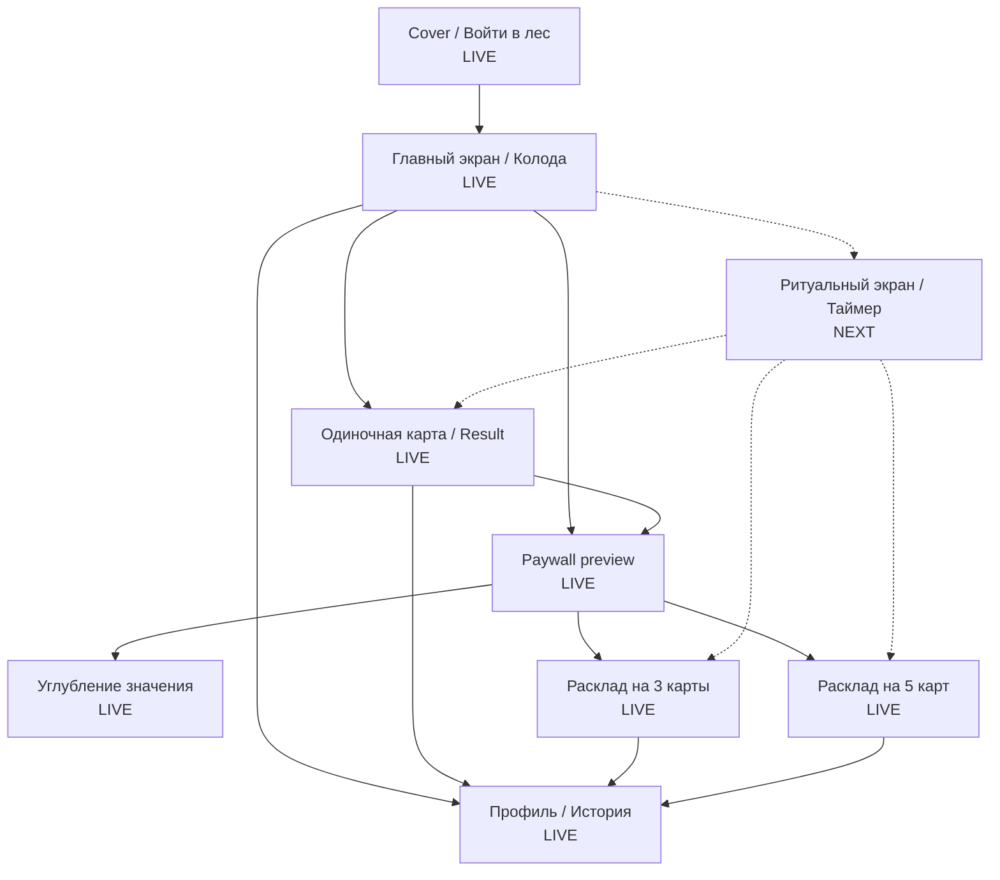
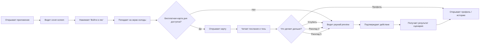
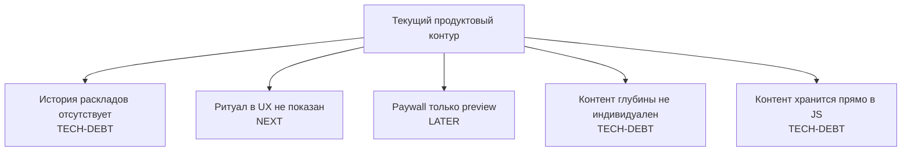
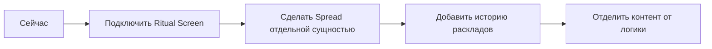

# Visual Roadmap: WYRD

## Как читать этот документ

Это визуальная карта продукта для быстрого контроля.

Она отвечает на 3 вопроса:

1. Какие экраны уже есть
2. Какой пользовательский сценарий сейчас реализован
3. Где у нас `live`, где `tech-debt`, а где следующий шаг

---

## Легенда статусов

- `LIVE` — уже реализовано в коде
- `TECH-DEBT` — работает, но требует доработки
- `NEXT` — логичный следующий шаг
- `LATER` — позже, не срочно

---

## 1. Карта экранов

---

## 2. Главный пользовательский сценарий

---

## 3. Что именно сейчас реализовано по страницам

| Экран / секция | Назначение | Статус | Комментарий |
|---|---|---|---|
| `Cover` | Вход и первое впечатление | `LIVE` | Работает как стартовый экран |
| `Deck` | Главная точка входа в действия | `LIVE` | Колода и основное действие уже есть |
| `Result` | Показ одной карты | `LIVE` | Есть карта, послание, тень, deep-state |
| `Spread Result` | Показ расклада | `LIVE` | Работают расклады на 3 и 5 карт |
| `Paywall` | Preview платных сценариев | `LIVE` | Это пока локальный placeholder |
| `Profile / History` | Профиль и история | `LIVE` | История только одиночных чтений |
| `Ritual Screen` | Промежуточный ритуальный UX | `NEXT` | Модуль таймера есть, в UX не подключён |

---

## 4. Сценарии продукта по статусам

| Сценарий | Статус | Что происходит сейчас |
|---|---|---|
| Вход в приложение | `LIVE` | Пользователь входит через cover-screen |
| Бесплатная карта дня | `LIVE` | Одна бесплатная карта в день через локальный state |
| Повторное открытие карты | `LIVE` | Идёт через paywall preview |
| Углубление значения | `LIVE` | Есть дополнительный слой текста |
| Расклад на 3 карты | `LIVE` | Генерируется и показывается |
| Расклад на 5 карт | `LIVE` | Генерируется и показывается |
| Профиль | `LIVE` | Показывает статус и историю |
| История одиночных карт | `LIVE` | Сохраняется в localStorage |
| История раскладов | `TECH-DEBT` | Пока не сохраняется как история |
| Ритуальный таймер в живом UX | `NEXT` | Код есть, но путь пользователя пока мгновенный |
| Реальная монетизация | `LATER` | Сейчас только визуальный preview |

---

## 5. Продуктовый путь по шагам

### Текущий путь пользователя

1. Пользователь открывает приложение
2. Видит атмосферный `Cover`
3. Нажимает `Войти в лес`
4. Попадает на `Deck`
5. Получает бесплатную карту или уходит в `Paywall preview`
6. Видит `Result`
7. Может открыть `Deep Reading`, `Spread 3`, `Spread 5` или `Profile`

### Что здесь самое важное

- вся логика продукта сейчас строится вокруг одного центрального экрана: `Deck`
- `Result`, `Spread`, `Paywall`, `Profile` являются производными сценарными ветками
- самый естественный следующий шаг в развитии UX: добавить реальный `Ritual Screen`

---

## 6. Где сейчас слабые места

---

## 7. Что я рекомендую считать главным next step

---

## 8. Как использовать это в работе со мной

Ты можешь ставить мне задачи прямо от этой карты.

Примеры формулировок:

- "работаем по visual roadmap, улучшаем экран Deck"
- "добавь новый сценарий после Result и обнови visual roadmap"
- "перестрой путь пользователя между Paywall и Spread"
- "сделай Ritual Screen как следующий этап и обнови все документы"
- "обнови инфографику, чтобы я видела новый продуктовый путь"

---

## 9. Быстрые команды для нашей совместной работы

Если хочешь, можешь просто писать мне коротко:

- `обнови visual roadmap`
- `покажи, где сейчас точка роста`
- `работаем по текущему сценарию`
- `измени сценарий между cover и result`
- `добавь новую страницу и отрази её в roadmap`

---

## 10. Связанные документы

- [README.md](/Users/marinamart/Desktop/Oracle_dev/README.md)
- [ARCHITECTURE.md](/Users/marinamart/Desktop/Oracle_dev/ARCHITECTURE.md)
- [docs/README.md](/Users/marinamart/Desktop/Oracle_dev/docs/README.md)
- [docs/ROADMAP.md](/Users/marinamart/Desktop/Oracle_dev/docs/ROADMAP.md)
- [docs/FEATURES.md](/Users/marinamart/Desktop/Oracle_dev/docs/FEATURES.md)

---

## Change Log

### 2026-04-05

- создан визуальный roadmap по страницам и текущему пользовательскому сценарию
