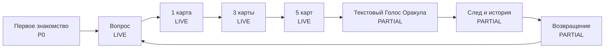
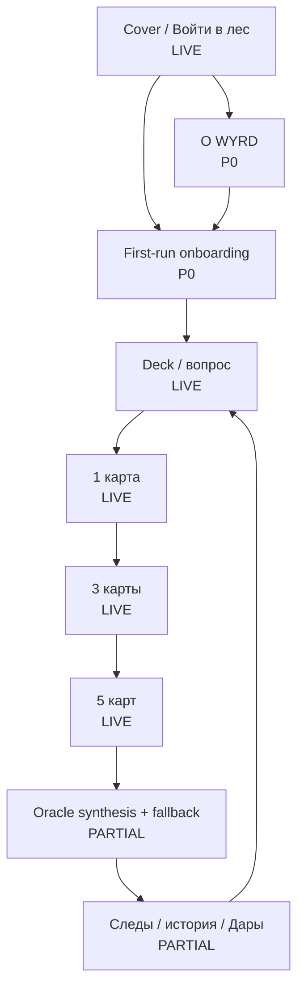
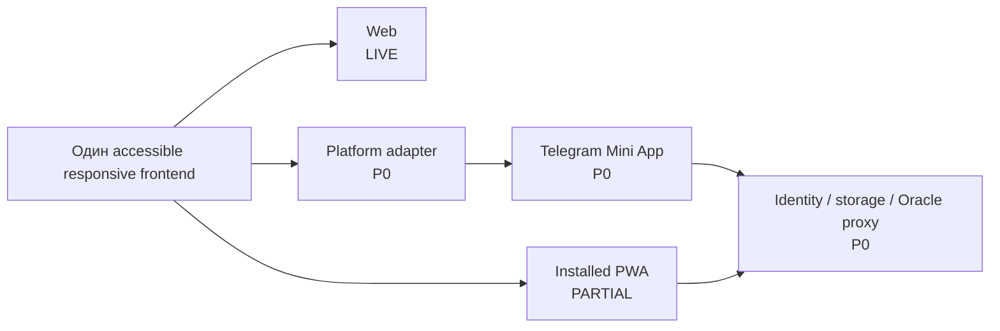
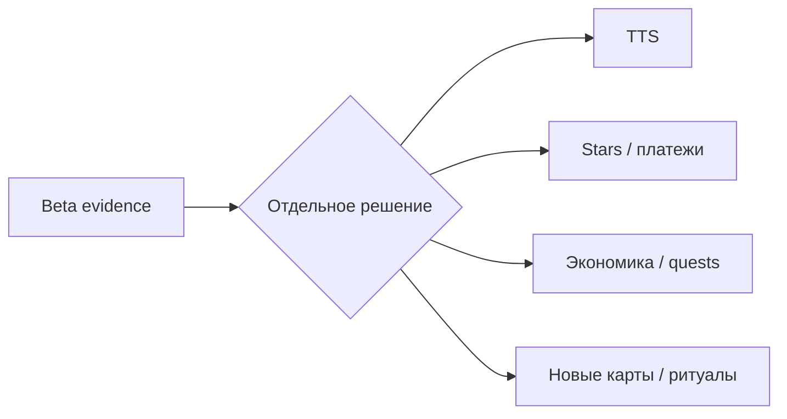

# Visual Roadmap: WYRD Telegram Beta

## Статусы

- `LIVE` — присутствует в production baseline;
- `PARTIAL` — работает, но требует укрепления для MVP;
- `P0` — обязательно для первой беты;
- `LATER` — только после beta evidence.

Scope определяет [TELEGRAM_BETA_SCOPE.md](TELEGRAM_BETA_SCOPE.md), статусы задач — Linear.

## Целевой пользовательский цикл

```mermaid
flowchart LR
    A["Первое знакомство<br/>P0"] --> B["Вопрос<br/>LIVE"]
    B --> C["1 карта<br/>LIVE"]
    C --> D["3 карты<br/>LIVE"]
    D --> E["5 карт<br/>LIVE"]
    E --> F["Текстовый Голос Оракула<br/>PARTIAL"]
    F --> G["След и история<br/>PARTIAL"]
    G --> H["Возвращение<br/>PARTIAL"]
    H --> B
```

В первой бете весь путь 1→3→5 открыт бесплатно. Paywall и Stars не входят в этот цикл.

## Карта продукта

```mermaid
flowchart TD
    Cover["Cover / Войти в лес<br/>LIVE"] --> Onboarding["First-run onboarding<br/>P0"]
    Onboarding --> Deck["Deck / вопрос<br/>LIVE"]
    Cover --> About["О WYRD<br/>P0"]
    About --> Onboarding
    Deck --> Single["1 карта<br/>LIVE"]
    Single --> Spread3["3 карты<br/>LIVE"]
    Spread3 --> Spread5["5 карт<br/>LIVE"]
    Spread5 --> Voice["Oracle synthesis + fallback<br/>PARTIAL"]
    Voice --> Trace["Следы / история / Дары<br/>PARTIAL"]
    Trace --> Deck
```

## Платформенный путь

```mermaid
flowchart LR
    Frontend["Один accessible responsive frontend"] --> Web["Web<br/>LIVE"]
    Frontend --> PWA["Installed PWA<br/>PARTIAL"]
    Frontend --> Adapter["Platform adapter<br/>P0"]
    Adapter --> Telegram["Telegram Mini App<br/>P0"]
    Telegram --> Backend["Identity / storage / Oracle proxy<br/>P0"]
    PWA --> Backend
```

## Сознательно позже

```mermaid
flowchart LR
    Evidence["Beta evidence"] --> Decision{"Отдельное решение"}
    Decision --> TTS["TTS"]
    Decision --> Payments["Stars / платежи"]
    Decision --> Meta["Экономика / quests"]
    Decision --> Expansion["Новые карты / ритуалы"]
```

## Change Log

### 2026-06-22

- удалён устаревший платёжный flow первой беты;
- карта синхронизирована с YUK-14 и бесплатным циклом 1→3→5.
